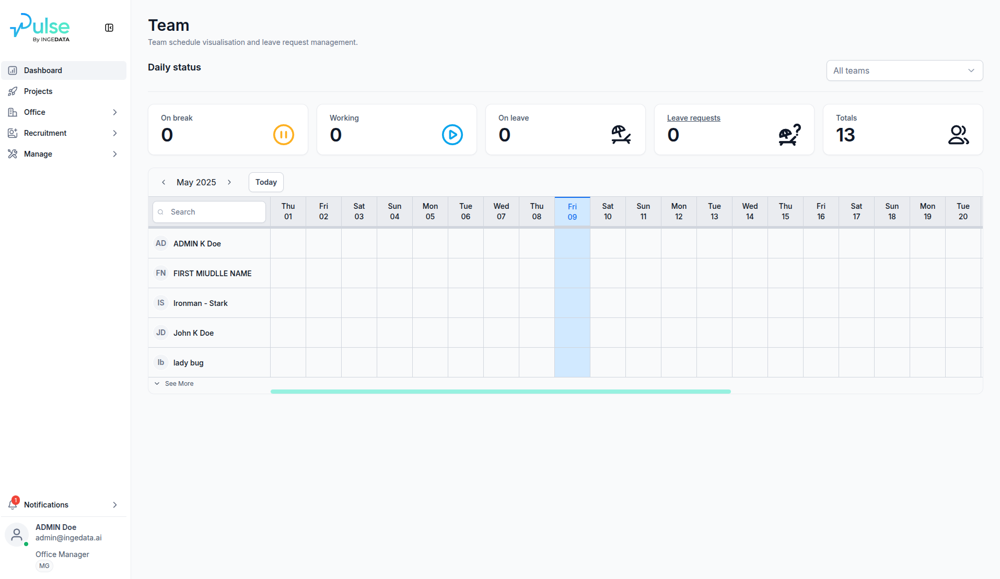
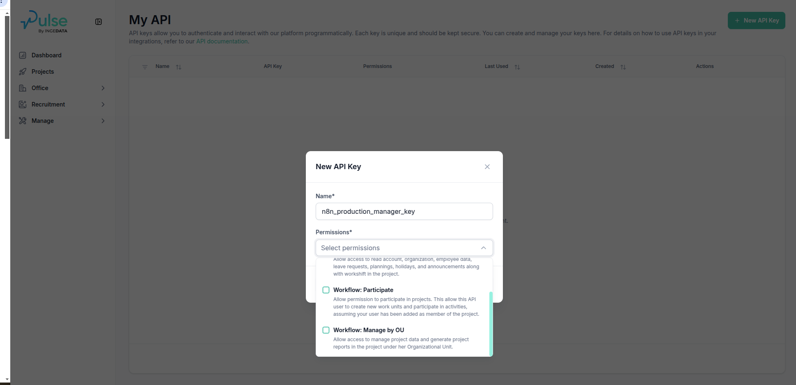
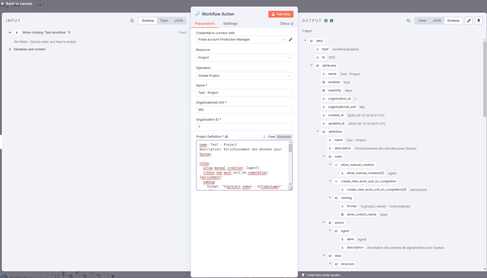

# n8n-ingedata-pulse

This package provides n8n nodes for integration with Ingedata's Pulse platform.

<div align="center">
  
</div>

## What is Pulse?



Pulse is an Enterprise Resource Planning (ERP) system developed by [Ingedata](https://ingedata.ai).
It is a comprehensive platform designed to streamline business operations, resource management, and data integration.
Pulse facilitates efficient workflow management, project tracking, and collaboration between teams.

As an ERP system, Pulse centralizes data and processes, enabling teams to work more efficiently with integrated workflows and automated business processes.

## Features

This package provides several nodes for interacting with different aspects of the Pulse platform. For more detailed documentation about these features, please visit [developer.ingedata.ai](https://developer.ingedata.ai).

### WorkflowAction Node

The WorkflowAction node is the primary tool for customers to interact with Pulse's project management capabilities:

- **Project Operations**:
  - Create, update, and list projects
  - Manage project status
- **Project Member Operations**:
  - Add, update, delete, and list project members
  - Assign roles and responsibilities
- **Project Document Operations**:
  - Create, update, delete, and list project documents
  - Manage document categories and access rights
- **Project Data Operations**:
  - Store and retrieve custom project data
- **Project Work Unit Operations**:
  - Create, list, and cancel project work units
- **Activity Operations**:
  - Assign members to activities

### AccountAction Node

- **Account Operations**:
  - Retrieve account information
  - Get current user account information

## Installation

Follow the [installation guide](https://docs.n8n.io/integrations/community-nodes/installation/) in the n8n community nodes documentation.

```bash
npm install n8n-ingedata-pulse
```

Or if you're using pnpm:

```bash
pnpm add n8n-ingedata-pulse
```

## Setup

1. Add your Pulse API credentials in n8n:

   

   - API Key
   - API URL (defaults to https://pulse.ingedata.ai)

#### Generate API Key from Pulse



#### Generated API Key


2. Use the nodes in your workflows

## Usage Examples

### Example 1: Managing Project Activities and Work Units

This workflow demonstrates how to create work units and assign team members to activities:


1. Set up a trigger node (e.g., "When Clicking Test Workflow")
2. Add a **WorkflowAction** node with "Project Members" resource:
   - Set Operation to "Get" to retrieve project member details
   - This provides the necessary account information for later assignment
3. Add a **WorkflowAction** node with "Project Work Units" resource:
   - Set Operation to "Create"
   - Configure a name for the work unit
   - Link to the appropriate project ID
4. Add a **WorkflowAction** node with "Activity" resource:
   - Set Operation to "Get List"
   - Use filters to retrieve activities related to the work unit
5. Add a final **WorkflowAction** node with "Activity" resource:
   - Set Operation to "Assign Member"
   - Specify the activity ID from the previous step
   - Select the account ID from the project member
   - Optionally set "Start Working" to true to immediately begin the activity

This workflow automates the process of creating work units and assigning team members to activities, streamlining project management in the Pulse platform.


### Example 2: Project Creation and Management Workflow

This workflow demonstrates how to create and manage projects in the Pulse platform:


1. Set up a trigger node (e.g., "When clicking Test workflow")
2. Add a **WorkflowAction** node with "Projects" resource:
   - Set Operation to "Create"
   - Configure project name, organizational unit, and other required fields
   - This creates a new project in the Pulse platform
3. Add a **WorkflowAction** node with "Projects" resource:
   - Set Operation to "Get List"
   - Use this to retrieve the newly created project or existing projects
4. Add a **WorkflowAction** node with "Projects" resource:
   - Set Operation to "Filter List"
   - Apply filters to narrow down the project list if needed
5. Add a **WorkflowAction** node with "Projects" resource:
   - Set Operation to "Update"
   - Update project name or other project details as needed
6. Also:
   - Add a **WorkflowAction** node to get account information
   - Add a **WorkflowAction** node with "Project Members" resource to add new team members
   - Add a **WorkflowAction** node to get project Members

This workflow provides a complete project setup process, from creation to team assignment and document management.




### Example 3: Managing Project Data and Documents

This workflow shows how to manage project data and documents:


1. Set up a trigger node (e.g., "When clicking Test workflow")
2. Add a **WorkflowAction** node with "Projects" resource:
   - Set Operation to "Get" to retrieve project details
3. Add a **WorkflowAction** node with "Project Data" resource:
   - Set Operation to "Get" to retrieve existing project data
4. Add a **Function** node:
   - Use this to prepare project data fields with key-value pairs
   - Format the data according to project requirements
5. Add a **Split Out** node:
   - Split the data into individual items for processing
6. Add a **Loop Over Items** node:
   - Process each data item individually
7. Add a **WorkflowAction** node with "Project Data" resource:
   - Set Operation to "Create" to store custom project data
   - Configure key, value, and label for each data point
8. Add a **WorkflowAction** node with "Project Documents" resource:
   - Set Operation to "Create" to add project documents
   - Configure document name, category, URL, and access rights

This workflow enables efficient management of project data and documents, allowing teams to store and organize project-related information in a structured way.


## License

ISC
